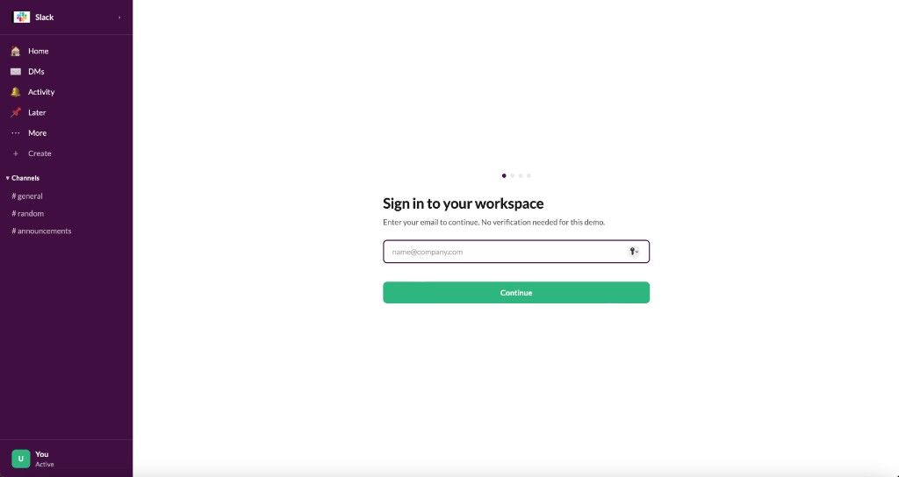
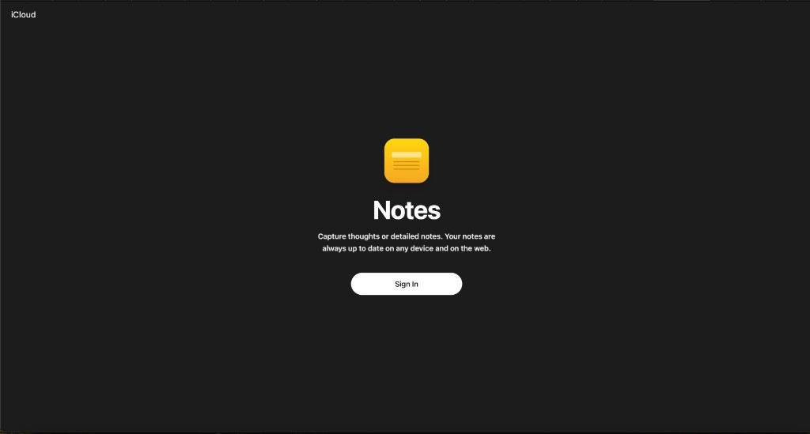
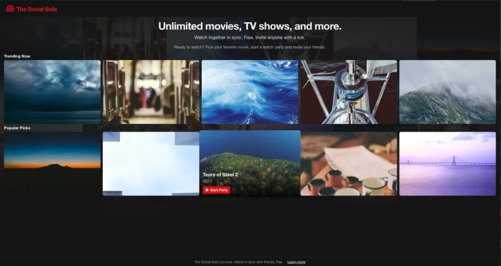
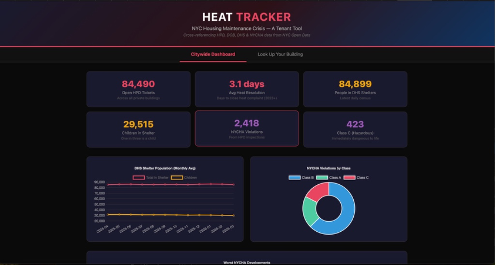
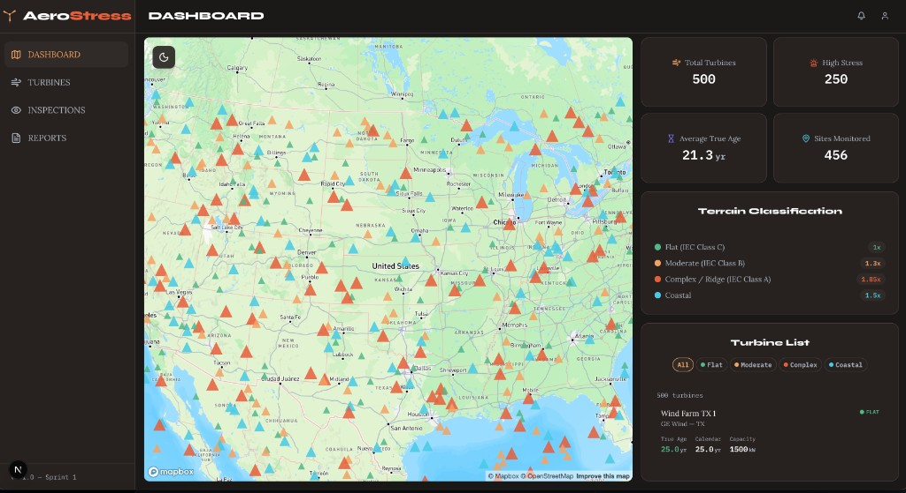

# My L2 Portfolio

---

## Project 1: Slack Smart-Notification Onboarding

**Problem:** New users suffer from "notification fatigue"—overwhelmed by default alerts or missing important messages. Default settings don’t give users control over their attention from day one.

**Solution:** A dedicated onboarding screen for new Slack users where they choose notification preferences (e.g. Direct Messages only or all activity) before entering the workspace.

**Features:**
- Sign-in flow with email (no verification needed for demo)
- Customizable notification preferences (DMs only, all activity, etc.)
- Workspace-style layout with channels and navigation
- Simple continue flow into the workspace

**Tech stack:** JavaScript, Node.js, Slack Webhooks, Vercel

**Code:** [GitHub](https://github.com/ibrahimadiallo-byte/Slack-Notification.git)

**Vercel link:** [Live app](https://slacknotification-ten.vercel.app/)

**Screenshot:**

---

## Project 2: iCloud Notes Web Clone

**Problem:** "Saving anxiety"—users worry about losing notes when they close the browser, lose connection, or forget to save.

**Solution:** A high-fidelity iCloud Notes–style web app with a three-column layout and automatic background sync that saves as you type.

**Features:**
- Dark-theme UI aligned with iCloud Notes
- Three-column layout (sidebar, note list, editor)
- Invisible auto-save with debounced state management
- Notes stay in sync across sessions and devices

**Tech stack:** React, CSS, Vercel, debounced state management

**Code:** [GitHub](https://github.com/LubaKaper/iCloud-Notes-Clone.git)

**Vercel link:** [Live app](https://i-cloud-notes-clone.vercel.app/)

**Screenshot:**

---

## Project 3: The Social Sofa (Netflix Party Clone)

**Problem:** Streaming is usually solo. Friends in different places can’t easily watch the same movie in sync or chat while watching.

**Solution:** A watch-together platform that keeps playback in sync across devices in real time and adds a shared chat so friends can watch and react together.

**Features:**
- Synced playback (e.g. alignment checks every few seconds)
- Watch parties started from the catalog with “Start Party”
- Hero section and carousels: “Trending Now,” “Popular Picks”
- TMDB-powered movie/show browsing
- Invite via link; free to use

**Tech stack:** Next.js, Supabase, Tailwind CSS, TMDB API

**Code:** [GitHub](https://github.com/papesy384/Netflixclone.git)

**Vercel link:** [Live app](https://netflixclone-pearl-eight.vercel.app/)

**Screenshot:**

---

## Project 4: Heat Tracker

**Problem:** Raw maintenance and housing data (HPD, DOB, DHS, NYCHA) is hard to interpret. Spotting dangerous heat complaints, shelter trends, or violation spikes is difficult without clear visuals.

**Solution:** A tenant-focused dashboard that pulls NYC Open Data into one place and turns it into maps, charts, and KPIs so issues are visible at a glance.

**Features:**
- Citywide dashboard with KPIs (open HPD tickets, avg heat resolution, DHS shelter census, NYCHA violations, Class C hazardous)
- “Look Up Your Building” for address-level lookup
- Charts: DHS shelter population over time, NYCHA violations by class
- Cross-referenced HPD, DOB, DHS & NYCHA data from NYC Open Data

**Tech stack:** JavaScript, HTML/CSS, GitHub Pages

**Code:** [GitHub](https://github.com/papesy384/heat-tracker.git)

**Vercel link:** [Live app](https://papesy384.github.io/heat-tracker/) *(GitHub Pages)*

**Screenshot:**

---

## Project 5: AeroStress (Wind Turbine "True Age" Tracker)

**Problem:** Most tools treat all wind turbines the same. Turbines in complex or coastal terrain age faster due to turbulence and stress, leading to unexpected failures and high repair costs.

**Solution:** A predictive maintenance dashboard that computes “True Age” using terrain and site data, so operators can see which turbines are at higher risk before they fail.

**Features:**
- US map with turbines colored by terrain class (Flat, Moderate, Complex/Ridge, Coastal)
- KPIs: total turbines, high-stress count, average true age, sites monitored
- Terrain classification with IEC classes and multipliers
- Turbine list with filters (terrain type, site, true age, capacity)
- Navigation: Dashboard, Turbines, Inspections, Reports
- Mapbox GL JS + OpenStreetMap

**Tech stack:** Next.js, Supabase, Node.js, Mapbox GL JS, USWTDB data

**Code:** [GitHub](https://github.com/jonelrichardson-spec/AeroStress.git)

**Vercel link:** [Live app](https://aerostress.vercel.app)

**Screenshot:**

---
